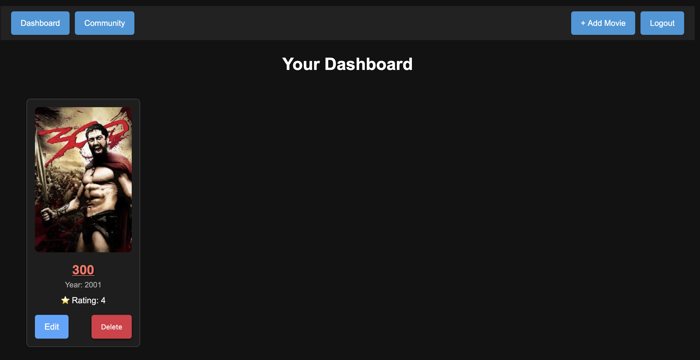
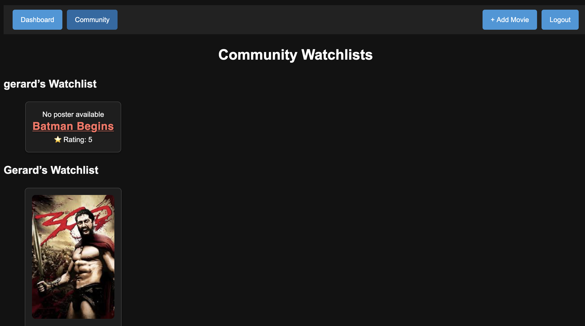

Absolutely! Let’s structure a **complete README** for your project that is clean, professional, and includes route diagrams. I’ll draft it section by section and include the ASCII-style route diagrams (you can replace them with actual images if you deploy to GitHub).

---

# **Letterboxd Clone**

A MERN-inspired Node/Express/MongoDB app that allows users to track, view, and manage their personal movie watchlist. Includes a community page to see other users’ movie lists.

---

## **Table of Contents**

1. [Project Overview](#project-overview)
2. [Live Demo](#live-demo)
3. [Technologies Used](#technologies-used)
4. [Features](#features)
5. [RESTful Route Map](#restful-route-map)
6. [Getting Started](#getting-started)
7. [Screenshots](#screenshots)
8. [Next Steps](#next-steps)


---

## **Project Overview**

This app is a movie tracking platform where users can:

* Create, view, edit, and delete their own movies
* See a dashboard of their personal watchlist
* Explore a community page showing movies added by all users (read-only for others’ movies)

The project fulfills the General Assembly MEN Stack CRUD App MVP requirements, including session-based authentication, RESTful routing, full CRUD functionality, and proper authorization.

---

## **Live Demo**

[Deployed App Link](#)

---

## **Technologies Used**

* **Node.js / Express.js** – Backend framework
* **MongoDB / Mongoose** – Database
* **EJS Templates** – Server-side rendering
* **Express-session & Connect-Mongo** – Session-based authentication
* **CSS / Flexbox** – Styling and layout
* **Method-Override** – PUT & DELETE support in forms

---

## **Features**

* User signup, login, and logout
* Dashboard showing personal movies
* Community page showing all users’ movies (read-only for others)
* Add, edit, delete movies (ownership enforced)
* RESTful routes for all movie operations
* Responsive design using CSS Flexbox

---

## **RESTful Route Map**

### **Movies Routes**

```
Dashboard (User's Movies)       GET /         -> shows logged-in user's movies
Community (All Users)           GET /movies/community
New Movie Form                  GET /movies/new
Create Movie                    POST /movies
Show Single Movie               GET /movies/:id
Edit Movie Form                 GET /movies/:id/edit
Update Movie                    PUT /movies/:id
Delete Movie                    DELETE /movies/:id
```

### **Users Routes (Auth)**

```
Auth Form (Login / Signup)      GET /users/auth?mode=login|signup
Signup                          POST /users/signup
Login                           POST /users/login
Logout                          POST /users/logout
```

---

## **Getting Started**

1. **Clone the repo**

```bash
git clone https://github.com/yourusername/letterboxd-clone.git
cd letterboxd-clone
```

2. **Install dependencies**

```bash
npm install
```

3. **Setup environment variables**
   Create a `.env` file with:

```
MONGODB_URI=your_mongo_uri_here
SESSION_SECRET=your_secret_here
PORT=3000
```

4. **Run the server**

```bash
npm start
```

5. Open [http://localhost:3000](http://localhost:3000) in your browser.

---

## **Screenshots**

**Login**

![Login Screenshot] (assets/screenshots/login.png)

**Dashboard**



**Community Page:**




## **Next Steps (Stretch Goals)**


* Add search/filter functionality on community page
* Allow commenting on other users’ movies

---

